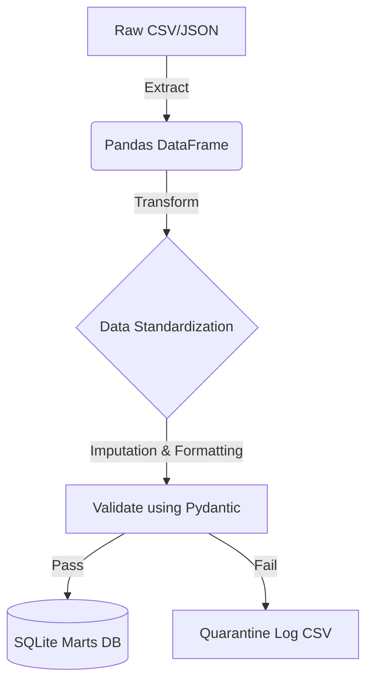

# Architecture

DataCleanse-Lite follows a modular Extract-Transform-Load (ETL) approach.

## Data Flow Diagram

## Core Modules

- `extract.py`: Ingests payloads from `/unprocessed` safely without mutation.
- `transform.py`: Core `pandas` logic (deduplication, date parsing, text stripping).
- `validate.py`: Applies `pydantic` schema models to evaluate data integrity.
- `load.py`: Pushes valid records to relational `SQLAlchemy` engine and bad records to flat files.
