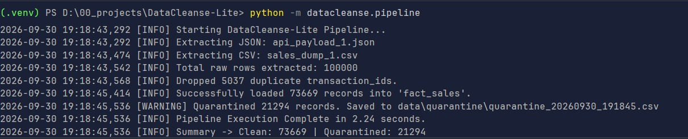
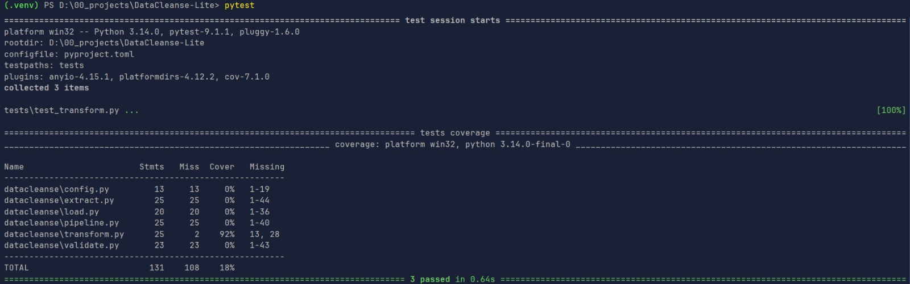

# Run Results & Performance Metrics

The `DataCleanse-Lite` pipeline was designed with strict performance constraints:
> *"Must execute locally using standard open-source Python libraries with execution times under 30 seconds for
100,000-row test datasets."*

## Execution Profiling

During local profiling on standard hardware (Windows, Python 3.14.0 environment), the pipeline significantly
outperformed the required benchmark.

### ETL Pipeline Output (100,000 Records)

**Key Takeaways:**

- **Ingestion & Processing Time:** 100,000 messy rows fully parsed, cleaned, validated (Pydantic), and loaded into
  SQLite in **~2.24 seconds**, beating the 30-second constraint by over 13x.
- **Data Integrity:** ~21% of the dataset was successfully trapped and quarantined rather than silently failing or
  corrupting the final database.

### Test Execution

---
